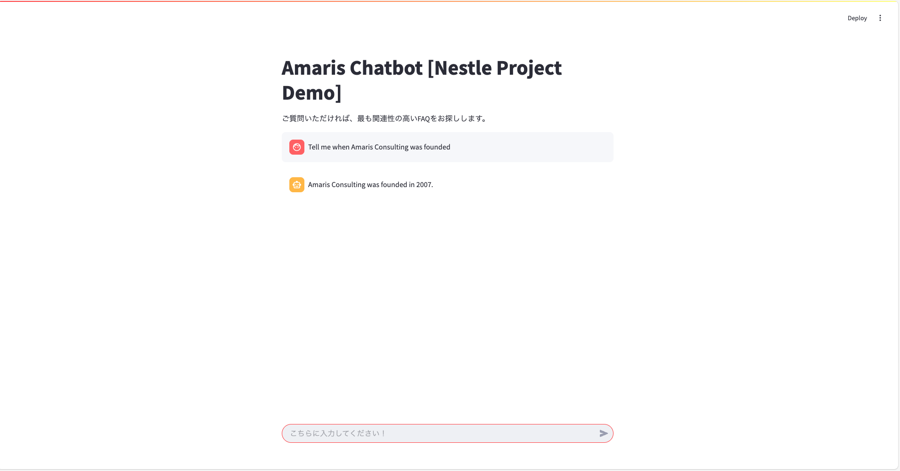

# 🤖 Amaris Chatbot - Simple Chatbot Prototype

A smart, context-aware chatbot web app built using **LangChain**, **Azure OpenAI**, and **FAISS**. Designed for internal corporate use, this chatbot helps automate responses to frequently asked questions by using **Retrieval-Augmented Generation (RAG)** architecture, minimizing hallucinations and maximizing answer accuracy.

<p align="center">
  
  
  
</p>

---

## 💡 Features

- ✅ RAG-based Answering System  
- ✅ Contextual Retrieval with FAISS  
- ✅ Multi-turn Conversation History  
- ✅ Secure Environment Management (.env)  
- ✅ Streamlit Chat UI for smooth and interactive communication  

---

## 🧠 Architecture

User Question ->
Vector Retrieval via FAISS ->
Context-Aware Prompt Generation (LangChain) ->
Azure OpenAI Chat Completion (LLM) ->
Final Answer (Based on facts, not hallucination)

---

## 🚀 Quick Start

### 1. Setup

```bash
git clone https://github.com/melvin555/melvin-proto-chatbotapp
cd melvin-proto-chatbotapp
pip install -r requirements.txt
```
1. Make sure to configure your .env file using your Azure OpenAI credentials.

2. Create Vector DB
See INDEXING.md for how to create the vector database from your dataset.

3. Run the App
```streamlit run chatbot_app.py```
Then open your browser at http://localhost:8501.

📄 Sample Use Case
Ask a question like:
```
「Amaris Consulting の得意分野は何ですか？」
```
The chatbot will:

Search for the most relevant Q&A in the FAISS index

Provide a natural-language answer based on actual facts from your dataset

If no answer is found, it replies politely:

```
申し訳ありませんが、データベースにない課題です。こちらのリンクをご参考にしていただければ幸いです。：www.amaris.com
```
🧠 Technologies Used
🧠 LangChain – for chaining retrieval + generation

🔍 FAISS – efficient vector similarity search

💬 Azure OpenAI (GPT-4 / GPT-3.5) – LLM-based natural response

🖥️ Streamlit – fast web UI development

📦 python-dotenv – secure API key management

🧪 Dataset
The Q&A dataset is based on 100 samples related to Amaris Consulting pulled from publicly available sources.

🖥️ Screenshot


👨‍💻 Author
Melvin Harsono
